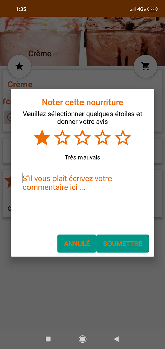

# midounoo_app

Midounoo est une application cliente de livraison de restaurants à domicile.

L'application embarque des fonctionnalités comme la géolocalisation, l'ajout de menu dans le panier, la consultation du panier,
l'inscription et la connexion sur l'application via Email, google, facebook et via un numéro de téléphone.
L'utilisateur peut éditer son profil, rajouter ses adresses de bureau ou de domicile, consulter l'historique de ses commandes,
ajouter un menu à ses favoris etc...

Le backend est réalisé avec firebase et une partie avec l'orm Room.

# Quelques captures d'écran de l'application
 

 

 

 

 

 

 
